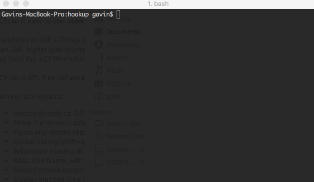

Hook me up bru!
===============

WIP

Hookup. a console application connecting you & managing your ~/.ssh/config through the use of 
local & remote yaml files.

`.hookup.yml` files can be placed within web/infrastructure projects locally or stored
remotely via github repositories.




# Example
```
// ~/.hookup.yml
hookup:
  servers:
    my-web-server:
      hostname: 1.1.1.1
      user: gavin
      port: 444
      
```

Updating your configuration is as simple as `hookup update`

# Github Configuration
```
hookup:
  github:
    token: <<OAUTH2_TOKEN>>
    repositories:
      - gsdevme/hookup
      - gsdevme/awesome-web-project
```

# User Configuration

Overriding the system user globally, this is very useful if you have a different system
user to your servers)
```
hookup:
  user: my-ssh-user
```

You can also override on a per server basis
```
hookup:
  user: gavin
  servers:
    my-web-server:
      hostname: 1.1.1.1
      user: gsdev
```
